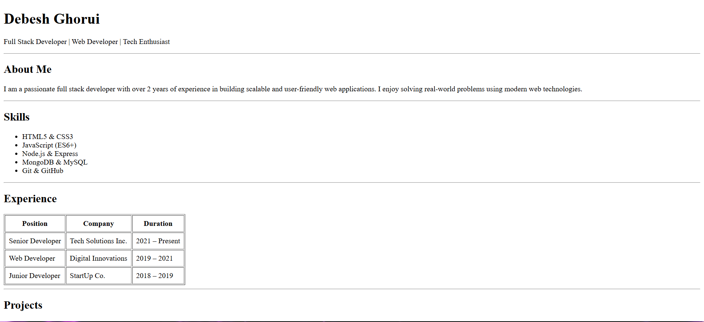

# HTML Resume Website

This project is a **single-page resume website** built using **pure HTML**.

The goal of this assignment is to demonstrate proper use of **HTML semantics**, clean structure, and readability **without using CSS**.

---

## 📌 Project Overview

The resume website includes all essential sections of a professional resume such as:

- Header with name and title
- About Me
- Skills list
- Experience table
- Projects section
- Education table
- Contact details
- Footer

The layout closely follows the provided reference while keeping the code semantic and well-structured.

---

## 🖼️ Screenshots

